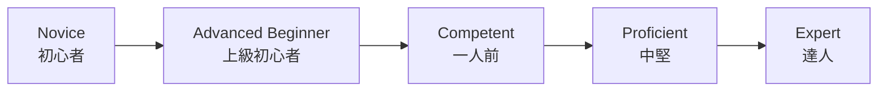
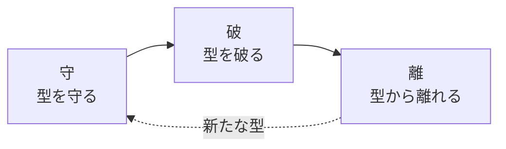
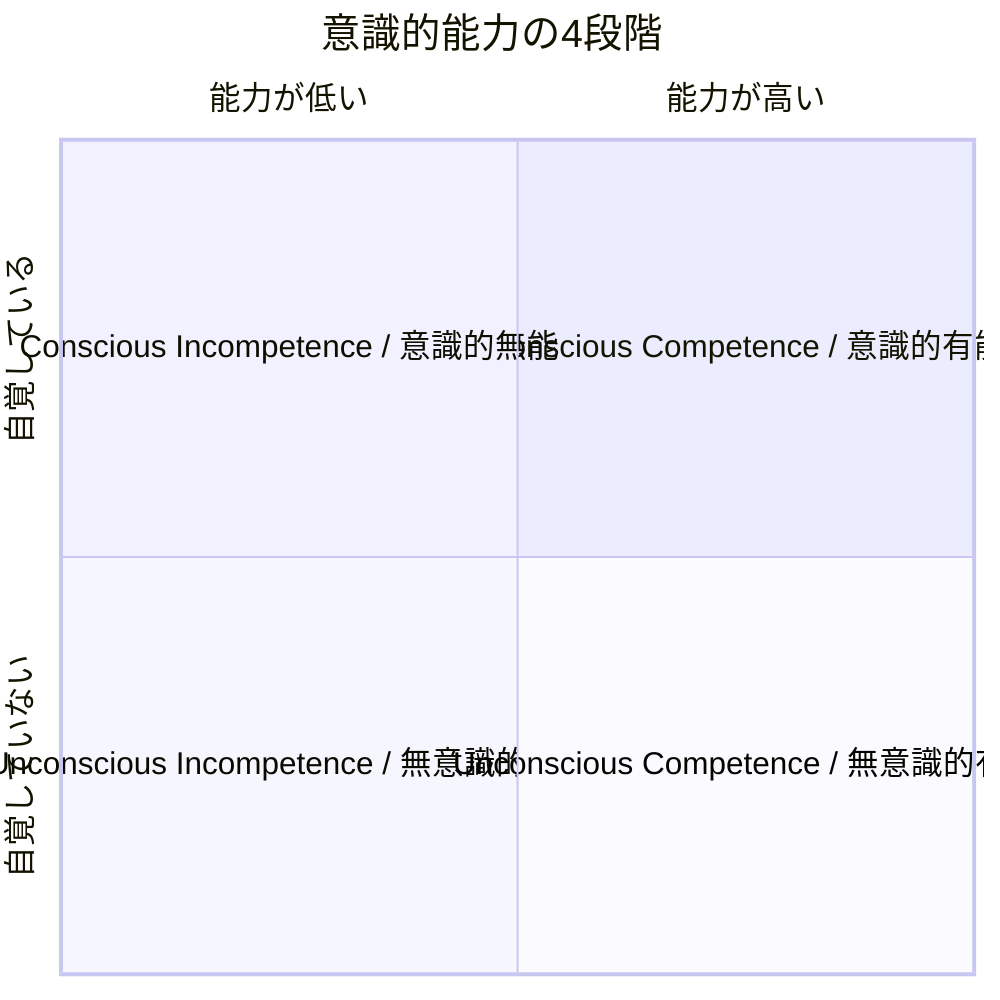

+++
title = '技術習熟の3つのモデル：ドレイファス・守破離・意識的能力の4段階'
description = 'ドレイファスモデル、守破離、意識的能力の4段階という3つの技術習熟フレームワークを比較し、それぞれの特徴と応用方法を解説します。'
date = 2026-04-19T00:00:00+09:00
draft = false
categories = ["Blog"]
tags = ["Learning", "Mastery", "Dreyfus", "Shu-Ha-Ri"]
+++

## 概要

私たちが何らかの技能を身につけていく過程は、一様ではありません。初めは手順書に頼り、やがて状況に応じた判断ができるようになり、さらに進むと無意識のうちに最適な動作ができるようになります。こうした段階的な変化を捉えるために、古くから多くのモデルが提唱されてきました。

本記事では、代表的な3つの習熟フレームワーク、**ドレイファスモデル**、**守破離**、**意識的能力の4段階** を紹介し、それぞれの背景・段階構造・特徴を比較します。自分の現在地を知り、次の一歩を設計し、他者の学びを支えるための道具として、これらのモデルがどう使えるかを整理します。

## なぜ習熟段階を理解するのか

習熟を段階として捉えるメリットは、大きく3つあります。

1つ目は **自己理解** です。自分が今どの段階にいるのかが分かると、次に何を身につけるべきかが見えてきます。新人の頃に必要だった「手順を正確にこなす力」と、中堅になってから求められる「状況に応じた判断力」はまったく別のスキルです。段階を意識することで、努力の方向を誤らずに済みます。

2つ目は **学習設計** です。最終ゴールだけを見て漠然と努力するより、段階的なマイルストーンを置くほうが継続しやすく、成長も確認しやすくなります。段階ごとに「今の自分に合った学び方」が変わることも、多くのモデルが示しています。

3つ目は **他者理解** です。後輩を指導する場面や、チームメンバーの成長を見守る場面で、相手がどの段階にいるかを見立てられれば、必要な支援や関わり方を選びやすくなります。

ただし、モデルは現実そのものではありません。人の習熟は連続的で、領域ごとに段階がばらつくこともあります。本記事で紹介するモデルは、あくまで思考の補助線として使うものだと覚えておきたいところです。

## ドレイファスモデル

### 出自と背景

ドレイファスモデルは、Stuart E. Dreyfus と Hubert L. Dreyfus の兄弟が1980年にカリフォルニア大学バークレー校でまとめた報告書 "A Five-Stage Model of the Mental Activities Involved in Directed Skill Acquisition" で提唱されたモデルです。もともとは米空軍科学研究局の委託研究であり、パイロットの訓練やチェスプレイヤー、自動車運転など、幅広い技能習得を題材に論じられました。

兄のスチュワートはオペレーションズ・リサーチ、弟のヒューバートは哲学（現象学）を専門とし、2人の共著として「熟達者の判断が必ずしも明示的なルールで説明できない」という問題意識を形にしたのがこのモデルです。

後にソフトウェアエンジニアリングの領域でも、Andy Hunt の著書『Pragmatic Thinking and Learning』などを通じて広く紹介され、エンジニアの成長を語るときの共通言語のひとつになりました。

### 5段階の構造

ドレイファスモデルは、人が未経験の状態から熟達者に至るまでを5段階で描きます。

各段階の特徴は次の通りです。

**1. Novice（初心者）**
状況を文脈から切り離し、与えられたルールに従って行動します。ルールを守ることで精一杯で、例外や全体像を見る余裕はありません。料理で言えばレシピ通りに計量する段階、運転で言えばマニュアル通りにペダルとハンドルを操作する段階です。

**2. Advanced Beginner（上級初心者）**
経験を積む中で、状況に付随する特徴に気づき始めます。とはいえ、どの特徴が重要でどれが些末かの見分けはまだつかず、すべてを同じ重みで扱いがちです。先輩に細かく質問し、カバーできないケースに直面して初めて学ぶ段階と言えます。

**3. Competent（一人前）**
複数の情報の中から重要なものを選び、自分で目標と計画を立てられるようになります。ルールは内面化され、状況への適応度が上がります。一方で「正解はひとつではない」ことが分かり始め、判断の責任を感じて悩むのもこの段階の特徴です。

**4. Proficient（中堅）**
状況を全体として捉え、何が起きているかを俯瞰できるようになります。過去の類似ケースを引き寄せてパターン認識で判断し、細部をルールで詰めるのはその後、という順序に逆転していきます。直感と分析の両方を使い分けるハイブリッドな段階です。

**5. Expert（達人）**
明示的なルールを意識せず、状況に埋め込まれた「正解」を直感的に導きます。熟達した医師が患者を一目見て診断の見当をつけたり、棋士が盤面を見て候補手を絞り込むように、分析より前に判断が立ち上がります。ただし、環境が通常と大きく異なる場合には、達人も意識的な分析に戻る必要があります。

### 段階を移るときに起きる認知の変化

このモデルが示唆する重要な点は、段階を上がるにつれて認知の中心が「分析」から「パターン認識」、さらに「直感」へと移っていくことです。これは単に速くなるというだけでなく、何を見ているかが変わるという質的な変化です。

また、上位段階に進むには、ルールに従うだけでなく「ルールを文脈に応じて解釈する経験」が欠かせません。ドレイファス兄弟は、熟達とは暗黙知の獲得であり、それを教科書的に教えることは難しいと繰り返し指摘しています。

## 守破離

### 出自と背景

守破離（しゅはり）は、日本の武道・茶道・華道といった伝統芸能の世界で発達してきた修行の段階論です。明確な成文として現れるのは江戸時代中期の茶人、川上不白（1719-1807）による『不白筆記』と伝えられていますが、その源流はさらに古く、世阿弥（1363-1443）が『風姿花伝』で示した「序破急」の発想や、千利休の教えに連なるとされます。

利休道歌として知られる一首に、「規矩作法 守り尽くして 破るとも 離るるとても 本（もと）を忘るな」という歌があり、これが守破離という言葉を象徴する一節としてよく引用されます。型を守り、やがて破り、さらに離れても、根本を忘れてはならない——というメッセージです。

近年では、アジャイル開発・スクラム・デザインパターン学習など、西洋生まれの知的実践にも「守破離」が応用され、日本語圏のソフトウェア業界では共通語のひとつになりました。

### 3段階の構造

守破離は、師匠と弟子の関係を前提とした3段階のモデルです。

**守**
師匠や流派の教える型を、忠実に守って稽古する段階です。自分の解釈を加えずに正確に反復することが求められます。「なぜこうするのか」は後から分かることが多く、まずは身体や思考に型を染み込ませる時期と言えます。

**破**
守の段階で体得した型を下敷きに、他流派の型や自分の工夫を取り入れて型を破っていく段階です。単なる反抗ではなく、比較と検証を通じて型を吟味する営みであり、ここで初めて「なぜそうするのか」が腹落ちしてきます。

**離**
型から離れ、独自の境地に至る段階です。このとき、型を捨てたのではなく、型が自分の一部になっているため、外から見ると型に縛られず自在に動いているように見えます。利休道歌の「本を忘るな」は、離に至っても根は守の時期にあることを戒めた言葉です。

### 西洋モデルとの違い

ドレイファスモデルが個人の認知活動の変化を描くのに対し、守破離は **共同体の中で型を受け渡す** ことを前提にしています。型には流派の歴史や先人の知恵が凝縮されており、それを正確に受け継ぐ「守」の時期がまずある、という思想です。

また、守破離は **学習者の主体性の現れ方** を段階で示すモデルとも読めます。守では受容、破では対話と検証、離では創造が中心になり、単なるスキル上達ではなく人格の成熟や世界観の拡張まで含意する点も特徴的です。

### 現代での応用例

- **ソフトウェア開発のパターン学習**: まずはデザインパターンをそのまま適用し（守）、プロジェクトに応じて変形し（破）、最終的にはパターンに頼らず問題に応じた設計ができる（離）、という学びの道筋として語られます。
- **スクラム導入**: 最初はスクラムガイドに忠実に従い、チームが習熟してきたら自分たちのコンテキストに合わせてイベントや役割を調整する、という段階論として引用されます。
- **新人教育全般**: 手順書通りに動く時期、自分なりの工夫を加える時期、仕組みそのものを設計する時期、という段階的な関わり方の指針として用いられます。

## 意識的能力の4段階

### 出自と背景

「意識的能力の4段階（Four Stages of Competence、別名 Conscious Competence Ladder）」は、1970年代に米国の Gordon Training International で講師を務めた Noel Burch が提唱したとされる学習モデルです。ただし、原型となる考え方はそれ以前から存在し、心理学者 Abraham Maslow に帰属させる説、同じく Thomas Gordon に帰属させる説もあるため、出典は完全に一意ではありません。

このモデルの特徴は、学習者の **能力の有無** と、その能力の **自覚の有無** という2つの軸を組み合わせて段階を整理している点です。能力そのものだけでなく「自分が何を知らないか／知っているか」をどれだけ意識できているかに焦点を当てており、学習者の心理面を扱いやすいフレームとして知られています。

### 4段階の構造

4つの段階は、意識と能力の組み合わせで次のように表現できます。

**1. Unconscious Incompetence（無意識的無能）**
できないことに気づいていない段階です。自分が何を知らないかすら分からないため、学習の必要性を感じません。ここからの脱出には、外部からのフィードバックや「できない現実」に気づかせる刺激が鍵になります。

**2. Conscious Incompetence（意識的無能）**
できないことを自覚した段階です。4段階のうち心理的にもっともストレスが大きく、「自分はダメだ」と感じて学習を諦めやすい危険地帯でもあります。ここを抜けるには、小さな成功体験を重ねられる環境と、安心して失敗できる関係性が重要です。

**3. Conscious Competence（意識的有能）**
意識的に注意を払えばできる段階です。手順を頭で辿りながら実行する状態で、疲れやすく遅くはあるものの、一貫して成果を出せるようになります。ここでの繰り返しが、次の段階への足場になります。

**4. Unconscious Competence（無意識的有能）**
考えなくても自然にできる段階です。タスクが自動化され、他のことに注意を振り向ける余裕が生まれます。ただし、言語化できないがゆえに「なぜそうするのか」を人に教えるのが難しくなる、という新たな課題が出てきます。

### 心理面の意義と第5段階

このモデルが他のモデルと異なるのは、**意識的無能の「谷」** をはっきりと示すところです。学ぶとは、まず「できない自分」に直面することであり、ここでの支援が学習の継続可否を大きく左右します。

近年では、第4段階の先に **Conscious Competence of Unconscious Competence（反省的有能／教えられる状態）** を置く派生モデルも提唱されています。これは、自動化された自分のスキルを再度意識に上げ、他者に言語化して伝えられる状態を指します。指導者・メンターに求められるのは、まさにこの第5段階の能力と言えるでしょう。

## 3つのフレームワークの比較

3つのモデルは一見似ているようで、着目している側面が異なります。まずは観点ごとに整理してみます。

| 観点 | ドレイファスモデル | 守破離 | 意識的能力の4段階 |
|------|----------------|--------|-----------------|
| 段階数 | 5 | 3 | 4（派生で5） |
| 観察する側面 | 判断・行動の質 | 型との関係 | 能力と自覚の組み合わせ |
| 文化的背景 | 西洋・哲学（現象学） | 日本・伝統芸能 | 西洋・教育心理 |
| 成立時期 | 1980年 | 江戸時代（源流はより古い） | 1970年代 |
| 学習者像 | 個人の認知の変化 | 共同体で型を受け継ぐ存在 | 意識と無意識を行き来する存在 |
| 熟達の到達点 | 直感的判断 | 型から離れた自在さ | 自動化された能力 |

### 共通点

表面的な違いを超えて、3つのモデルには共通する構造もあります。

- **初期は外部依存、後期は自律** という方向性。ルールや型、意識的な努力から始まり、やがてそれらが内面化されていく。
- **最上位は言語化しにくい熟達** として描かれる。ドレイファスの Expert、守破離の離、4段階の Unconscious Competence はいずれも、明示的な指示を超えた領域を指します。
- **段階の移行は直線ではない**。どのモデルも、ある段階に必要な学びが次の段階に進むと不要になるのではなく、基礎として残り続けることを前提にしています。

### 相違点

一方で、着目点の違いは明確です。

- **ドレイファスモデル** は「判断の質」にフォーカスします。ルール適用から直感的パターン認識への変化を、認知科学的に描いています。
- **守破離** は「型との関係」にフォーカスします。型を共有する共同体の存在と、そこから個として独立していく筋道を描きます。
- **意識的能力の4段階** は「意識の状態」にフォーカスします。特に「自分ができないと気づく瞬間」という心理的な転換点を明示的に扱います。

### どのモデルをいつ使うか

- **自分や他者の行動パターンを分析したい** とき → ドレイファスモデル
- **師匠・メンター・型が存在する学習環境** で段階を捉えたいとき → 守破離
- **学習者の心理状態を支えたい、挫折しそうな人を支援したい** とき → 意識的能力の4段階

目的に応じて使い分けるのが実践的で、1つに絞る必要はありません。むしろ、ある学習者の状況を複数のモデルで見てみると、違う側面が見えてくることが多いでしょう。
