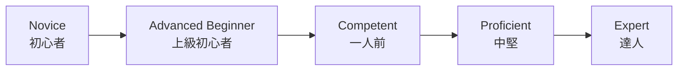

+++
title = '技術習熟の3つのモデル：ドレイファス・守破離・意識的能力の4段階'
description = 'ドレイファスモデル、守破離、意識的能力の4段階という3つの技術習熟フレームワークを比較し、それぞれの特徴と応用方法を解説します。'
date = 2026-04-19T00:00:00+09:00
draft = false
categories = ["Blog"]
tags = ["Learning", "Mastery", "Dreyfus", "Shu-Ha-Ri"]
+++

## 概要

私たちが何らかの技能を身につけていく過程は、一様ではありません。初めは手順書に頼り、やがて状況に応じた判断ができるようになり、さらに進むと無意識のうちに最適な動作ができるようになります。こうした段階的な変化を捉えるために、古くから多くのモデルが提唱されてきました。

本記事では、代表的な3つの習熟フレームワーク、**ドレイファスモデル**、**守破離**、**意識的能力の4段階** を紹介し、それぞれの背景・段階構造・特徴を比較します。自分の現在地を知り、次の一歩を設計し、他者の学びを支えるための道具として、これらのモデルがどう使えるかを整理します。

## なぜ習熟段階を理解するのか

習熟を段階として捉えるメリットは、大きく3つあります。

1つ目は **自己理解** です。自分が今どの段階にいるのかが分かると、次に何を身につけるべきかが見えてきます。新人の頃に必要だった「手順を正確にこなす力」と、中堅になってから求められる「状況に応じた判断力」はまったく別のスキルです。段階を意識することで、努力の方向を誤らずに済みます。

2つ目は **学習設計** です。最終ゴールだけを見て漠然と努力するより、段階的なマイルストーンを置くほうが継続しやすく、成長も確認しやすくなります。段階ごとに「今の自分に合った学び方」が変わることも、多くのモデルが示しています。

3つ目は **他者理解** です。後輩を指導する場面や、チームメンバーの成長を見守る場面で、相手がどの段階にいるかを見立てられれば、必要な支援や関わり方を選びやすくなります。

ただし、モデルは現実そのものではありません。人の習熟は連続的で、領域ごとに段階がばらつくこともあります。本記事で紹介するモデルは、あくまで思考の補助線として使うものだと覚えておきたいところです。

## ドレイファスモデル

### 出自と背景

ドレイファスモデルは、Stuart E. Dreyfus と Hubert L. Dreyfus の兄弟が1980年にカリフォルニア大学バークレー校でまとめた報告書 "A Five-Stage Model of the Mental Activities Involved in Directed Skill Acquisition" で提唱されたモデルです。もともとは米空軍科学研究局の委託研究であり、パイロットの訓練やチェスプレイヤー、自動車運転など、幅広い技能習得を題材に論じられました。

兄のスチュワートはオペレーションズ・リサーチ、弟のヒューバートは哲学（現象学）を専門とし、2人の共著として「熟達者の判断が必ずしも明示的なルールで説明できない」という問題意識を形にしたのがこのモデルです。

後にソフトウェアエンジニアリングの領域でも、Andy Hunt の著書『Pragmatic Thinking and Learning』などを通じて広く紹介され、エンジニアの成長を語るときの共通言語のひとつになりました。

### 5段階の構造

ドレイファスモデルは、人が未経験の状態から熟達者に至るまでを5段階で描きます。

各段階の特徴は次の通りです。

**1. Novice（初心者）**
状況を文脈から切り離し、与えられたルールに従って行動します。ルールを守ることで精一杯で、例外や全体像を見る余裕はありません。料理で言えばレシピ通りに計量する段階、運転で言えばマニュアル通りにペダルとハンドルを操作する段階です。

**2. Advanced Beginner（上級初心者）**
経験を積む中で、状況に付随する特徴に気づき始めます。とはいえ、どの特徴が重要でどれが些末かの見分けはまだつかず、すべてを同じ重みで扱いがちです。先輩に細かく質問し、カバーできないケースに直面して初めて学ぶ段階と言えます。

**3. Competent（一人前）**
複数の情報の中から重要なものを選び、自分で目標と計画を立てられるようになります。ルールは内面化され、状況への適応度が上がります。一方で「正解はひとつではない」ことが分かり始め、判断の責任を感じて悩むのもこの段階の特徴です。

**4. Proficient（中堅）**
状況を全体として捉え、何が起きているかを俯瞰できるようになります。過去の類似ケースを引き寄せてパターン認識で判断し、細部をルールで詰めるのはその後、という順序に逆転していきます。直感と分析の両方を使い分けるハイブリッドな段階です。

**5. Expert（達人）**
明示的なルールを意識せず、状況に埋め込まれた「正解」を直感的に導きます。熟達した医師が患者を一目見て診断の見当をつけたり、棋士が盤面を見て候補手を絞り込むように、分析より前に判断が立ち上がります。ただし、環境が通常と大きく異なる場合には、達人も意識的な分析に戻る必要があります。

### 段階を移るときに起きる認知の変化

このモデルが示唆する重要な点は、段階を上がるにつれて認知の中心が「分析」から「パターン認識」、さらに「直感」へと移っていくことです。これは単に速くなるというだけでなく、何を見ているかが変わるという質的な変化です。

また、上位段階に進むには、ルールに従うだけでなく「ルールを文脈に応じて解釈する経験」が欠かせません。ドレイファス兄弟は、熟達とは暗黙知の獲得であり、それを教科書的に教えることは難しいと繰り返し指摘しています。
