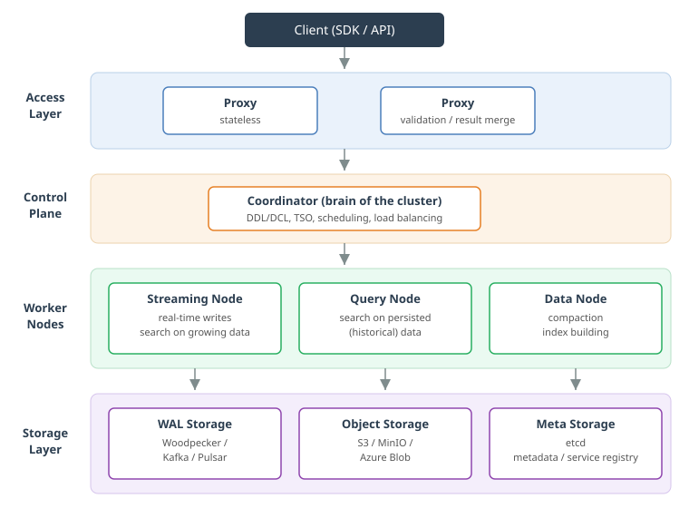
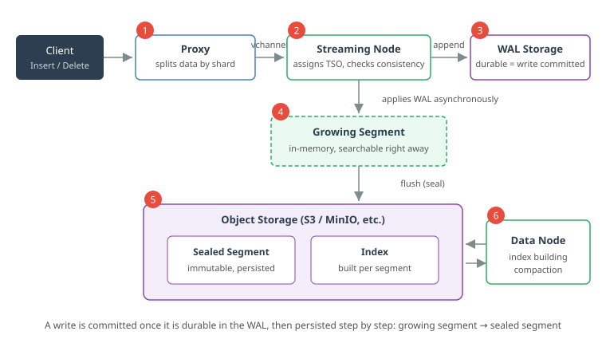
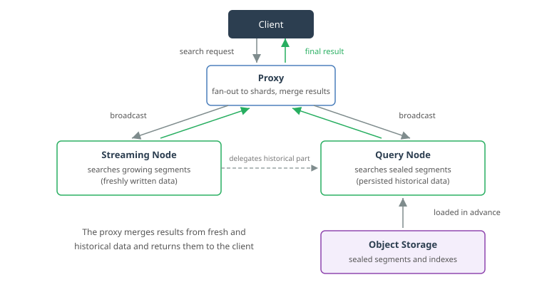

+++
title = 'Milvus Architecture Explained: Understanding the Four-Layer Design and Data Flows with Diagrams'
description = 'A clear, diagram-based walkthrough of the Milvus vector database architecture: the four layers (Proxy, Coordinator, worker nodes, storage), write and search data flows, growing/sealed segments, and the Woodpecker WAL — all based on the official documentation.'
date = 2026-06-11T00:00:00+09:00
draft = false
categories = ["Engineering"]
tags = ["Milvus", "Vector Search", "Database", "AI"]
+++

## Overview

With the rise of RAG (Retrieval-Augmented Generation) and recommendation systems, more and more teams are adopting **Milvus**, one of the most popular vector databases. Getting started with Milvus through its SDK is easy, but once you reach production operations and tuning, understanding how data actually flows inside the system makes a huge difference.

In this article, I explain the Milvus architecture based on the official documentation, with diagrams to make it easy to follow. You can also read it as a follow-up to my previous article, "[Introduction to Approximate Nearest Neighbor Search (ANN)](/en/blog/051-ann-basics/)", showing how those search algorithms operate as a distributed system.

Note that this article is based on the official documentation for **Milvus 2.6** ([Milvus Architecture Overview](https://milvus.io/docs/architecture_overview.md)). The architecture was significantly reorganized in 2.6, so the component layout differs from earlier versions.

## What Is Milvus?

Milvus is an **open-source, cloud-native vector database** designed for high-performance similarity search. Internally it leverages vector search libraries such as Faiss, HNSW, DiskANN, and SCANN, and it is widely used as a search backbone for AI applications and unstructured data (source: [Milvus Architecture Overview](https://milvus.io/docs/architecture_overview.md)).

Two design principles define its architecture:

- **Disaggregation of storage and computing**: all components are stateless, and the actual data lives in external storage
- **Separation of the data plane and control plane**: the components that process data and the components that manage the cluster are independent, so each can scale horizontally

## The Four-Layer Architecture at a Glance

A Milvus cluster consists of four layers (source: [Milvus Architecture Overview](https://milvus.io/docs/four_layers.md)).

### Access Layer

The access layer is a set of **stateless proxies** that receive client requests first. Their responsibilities are:

- Validating requests
- Providing a unified service endpoint together with load balancers such as Nginx or Kubernetes Ingress
- Aggregating intermediate results from worker nodes and returning the final result to the client

Because Milvus follows a massively parallel processing (MPP) design, it is the proxy that consolidates partial results into the final answer.

### Control Plane (Coordinator)

The Coordinator is described in the official documentation as "**the brain of Milvus**". It maintains cluster topology, schedules work, and ensures consistency. Its concrete responsibilities include:

- Handling DDL/DCL operations (creating collections, managing permissions, and so on)
- Timestamp management via the **TSO (Timestamp Oracle)**
- Managing WAL bindings with Streaming Nodes
- Managing Query Node topology and load balancing
- Distributing offline tasks such as compaction and index building

Exactly one Coordinator is active in the cluster, with master-slave options available for high availability.

### Worker Nodes (Execution Layer)

Three types of stateless nodes execute the Coordinator's instructions. The table below summarizes their roles.

| Node | Main role | Data handled |
| --- | --- | --- |
| Streaming Node | Real-time writes, shard-level consistency and recovery via the WAL, search on incremental data, converting growing data into sealed segments | Growing segments (freshly written data) |
| Query Node | Loading historical data from object storage and searching it | Sealed segments (persisted data) |
| Data Node | Offline processing such as compaction and index building | Sealed segments |

In Milvus 2.6, the roles were cleanly split — stream processing goes to the Streaming Node, batch processing goes to the Query Node and Data Node — achieving both real-time performance and high throughput (source: [Introducing Milvus 2.6](https://milvus.io/blog/introduce-milvus-2-6-built-for-scale-designed-to-reduce-costs.md)).

### Storage Layer

The storage layer holds the actual data and consists of three kinds of storage.

| Storage | Role | Implementations |
| --- | --- | --- |
| Meta Storage | Metadata snapshots, service registration | etcd |
| WAL Storage | Durability of writes (write-ahead logging) | Woodpecker, Kafka, Pulsar |
| Object Storage | Segments (log snapshots) and index files | MinIO, AWS S3, Azure Blob |

The reason every worker node can stay stateless is that all state is pushed down into this layer. Even if a node crashes, data can be recovered from the WAL and object storage.

## The Write Path

Let's look at how an insert request is processed (source: [Data Processing in Milvus](https://milvus.io/docs/data_processing.md)).

1. **The proxy routes data to shards**: a collection is divided into multiple **shards**, and each shard maps to a **vchannel (virtual channel)**. The proxy splits incoming data into per-shard packages according to the shard routing rules
2. **The Streaming Node assigns a TSO**: the Streaming Node responsible for each vchannel assigns a timestamp (TSO) to guarantee operation ordering and validates consistency
3. **Write to the WAL**: data is appended to WAL storage, and **the write is considered successful once it is durable there**. After a crash, the Streaming Node can replay the WAL to fully recover all pending operations
4. **Applied to a growing segment**: the Streaming Node asynchronously converts WAL entries into segments. Freshly written data becomes an in-memory **growing segment** and is already searchable at this point
5. **Flush turns it into a sealed segment**: when a flush is triggered, the growing segment becomes a **sealed segment** — immutable and persisted — in object storage
6. **The Data Node builds indexes**: the Data Node builds an index for each sealed segment independently and stores the result back in object storage

Because vector index building is computationally demanding, it relies on **SIMD acceleration** with instruction sets such as SSE, AVX2, and AVX512. Scalar fields use structures like Bloom filters and inverted indexes.

## The Search Path

A search request flows in the opposite direction: it gathers data that is spread across the cluster.

1. **The proxy broadcasts to all shards**: the search request is sent concurrently to every Streaming Node responsible for the related shards
2. **Streaming Nodes search the freshest data**: each Streaming Node generates a query plan and searches its local growing segments (data written moments ago)
3. **Query Nodes search historical data**: each Streaming Node also delegates the search over sealed segments (historical data) to remote Query Nodes, which search using segments and indexes loaded in advance from object storage
4. **The proxy merges the results**: the proxy collects the results from all shards, merges them, and returns the final outcome to the client

This design lets Milvus **return just-written data in search results while still searching massive historical data quickly through indexes**. When growing segments are flushed into sealed segments, the Coordinator performs a **handoff**, distributing the sealed segments evenly across the Query Nodes.

## Deployment Modes: Standalone vs. Cluster

Milvus offers two main deployment modes (source: [Milvus Main Components](https://milvus.io/docs/main_components.md)).

- **Standalone mode**: all components run in a single process. It suits small datasets and low workloads, and it can use embedded WAL implementations such as Woodpecker or rocksmq, eliminating third-party middleware dependencies. Note that **you cannot perform an online upgrade from a standalone instance to a cluster**
- **Cluster mode**: each component runs as an independent process and can be scaled out individually on Kubernetes. This mode is for large datasets and high-load production environments

A typical setup is standalone for development and testing, and cluster mode for production.

## How the Architecture Evolved in Milvus 2.6

Finally, here are the major architectural changes introduced in Milvus 2.6 (source: [Introducing Milvus 2.6](https://milvus.io/blog/introduce-milvus-2-6-built-for-scale-designed-to-reduce-costs.md)).

- **Introduction of the Streaming Node**: real-time responsibilities that were scattered across multiple components in 2.5 — consuming the message queue, writing incremental segments, serving incremental queries, and WAL-based recovery — are now consolidated into a dedicated Streaming Node
- **Woodpecker (zero-disk WAL)**: a cloud-native WAL system built to remove the dependency on external message queues like Kafka and Pulsar. With its "zero-disk" design, all log data is persisted directly in object storage, with no reliance on local disks (source: [Woodpecker Architecture](https://milvus.io/docs/woodpecker_architecture.md))
- **Coordinator merge**: the previously separate coordinators (RootCoord, QueryCoord, DataCoord, and so on) were merged into a single Coordinator, simplifying operations

All of these changes move in the same direction: fewer external dependencies and a simpler, cloud-native architecture that reduces cost and operational burden.

## Summary

In this article, I walked through the Milvus architecture based on the official documentation.

- Milvus is a cloud-native design built on **storage/computing disaggregation**, consisting of four layers: the access layer (Proxy), the control plane (Coordinator), worker nodes, and the storage layer
- The worker nodes have clearly separated roles: **the Streaming Node handles real-time processing, the Query Node searches historical data, and the Data Node handles offline processing**
- Writes are processed in stages — committed once durable in the WAL, then growing segment, then sealed segment via flush — while searches merge results from fresh and historical data at the proxy
- Milvus 2.6 introduced the Streaming Node and Woodpecker (zero-disk WAL) and merged the coordinators, evolving toward a simpler architecture with fewer external dependencies

Understanding these internal data flows makes it clear why just-written data shows up in search results and why data survives node failures — knowledge that pays off in capacity planning and troubleshooting in production.

## References

- [Milvus Architecture Overview | Milvus Documentation](https://milvus.io/docs/architecture_overview.md)
- [Storage/Computing Disaggregation | Milvus Documentation](https://milvus.io/docs/four_layers.md)
- [Main Components | Milvus Documentation](https://milvus.io/docs/main_components.md)
- [Data Processing | Milvus Documentation](https://milvus.io/docs/data_processing.md)
- [Introducing Milvus 2.6: Affordable Vector Search at Billion Scale | Milvus Blog](https://milvus.io/blog/introduce-milvus-2-6-built-for-scale-designed-to-reduce-costs.md)
- [Woodpecker Architecture | Milvus Documentation](https://milvus.io/docs/woodpecker_architecture.md)
