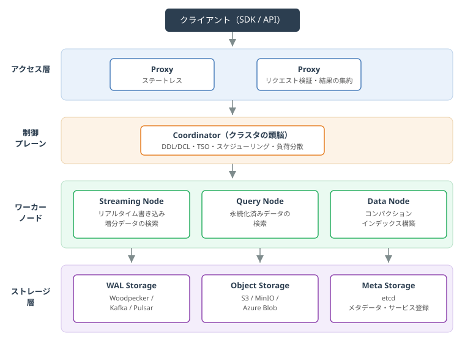
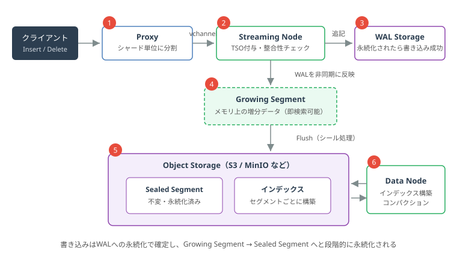
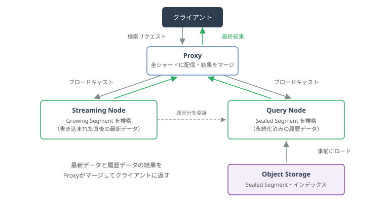

+++
title = 'Milvusのアーキテクチャをわかりやすく解説：4層構成とデータの流れを図解で理解する'
description = 'オープンソースのベクトルデータベースMilvusのアーキテクチャを図解でわかりやすく解説。Proxy・Coordinator・ワーカーノード・ストレージの4層構成、書き込みと検索のデータフロー、Growing/Sealed Segment、Woodpecker WALまで公式ドキュメントに基づき紹介します。'
date = 2026-06-11T00:00:00+09:00
draft = false
categories = ["Engineering"]
tags = ["Milvus", "Vector Search", "Database", "AI"]
+++

## 概要

RAG（検索拡張生成）やレコメンドの普及にともない、ベクトルデータベースの代表格である **Milvus** を採用する機会が増えています。Milvusは「とりあえず使う」だけならSDK経由で簡単に触れますが、本番運用やチューニングの段階になると、内部でデータがどう流れているかを理解しているかどうかで対応力が大きく変わります。

本記事では、Milvusのアーキテクチャを公式ドキュメントに基づいて、図解を交えながらわかりやすく解説します。前回の記事「[近似最近傍探索（ANN）入門](/blog/051-ann-basics/)」で扱った検索アルゴリズムが、システムとしてどう動くのかという視点でも読めるはずです。

なお、本記事は **Milvus 2.6系** の公式ドキュメント（[Milvus Architecture Overview](https://milvus.io/docs/architecture_overview.md)）に基づいています。2.6でアーキテクチャが大きく整理されたため、それ以前のバージョンとはコンポーネント構成が異なる点にご注意ください。

## Milvusとは

Milvusは、高性能な類似検索のために設計された **オープンソースのクラウドネイティブなベクトルデータベース** です。内部ではFaiss、HNSW、DiskANN、SCANNといったベクトル検索ライブラリを活用しており、AIアプリケーションや非構造化データの検索基盤として広く使われています（出典: [Milvus Architecture Overview](https://milvus.io/docs/architecture_overview.md)）。

アーキテクチャ上の最大の特徴は、次の2つの設計原則です。

- **ストレージとコンピューティングの分離**: すべてのコンポーネントはステートレスで、データの実体は外部ストレージに置かれます
- **データプレーンと制御プレーンの分離**: 「データを処理する役割」と「クラスタを管理する役割」を独立させ、それぞれを水平スケールできるようにしています

## 4層アーキテクチャの全体像

Milvusのクラスタは、大きく4つの層で構成されます（出典: [Milvus Architecture Overview](https://milvus.io/docs/four_layers.md)）。

### アクセス層（Access Layer）

クライアントからのリクエストを最初に受け付ける、**ステートレスなProxy** の集まりです。役割は次の通りです。

- リクエストの検証（バリデーション）
- NginxやKubernetes Ingressなどのロードバランサーと組み合わせた、統一エンドポイントの提供
- 各ノードから返ってくる中間結果を集約し、最終結果としてクライアントに返却

Milvusは大規模並列処理（MPP）型の設計のため、「結果をまとめ上げる」役割をProxyが担っている点がポイントです。

### 制御プレーン（Coordinator）

Coordinatorは公式ドキュメントで「**Milvusの頭脳（the brain of Milvus）**」と表現されるコンポーネントで、クラスタ全体のトポロジ管理・スケジューリング・一貫性の維持を担います。具体的な責務は以下の通りです。

- DDL/DCL（コレクション作成や権限管理など）の処理
- **TSO（Timestamp Oracle）** によるタイムスタンプ管理
- WALとStreaming Nodeの割り当て管理
- Query Nodeのトポロジ管理と負荷分散
- コンパクションやインデックス構築といったオフラインタスクの分配

アクティブなCoordinatorはクラスタに1つで、高可用性のためのマスター・スレーブ構成にも対応しています。

### ワーカーノード（実行層）

Coordinatorの指示を実行する、ステートレスな3種類のノードです。役割の違いを表にまとめます。

| ノード | 主な役割 | 扱うデータ |
| --- | --- | --- |
| Streaming Node | リアルタイム書き込み、WALによるシャード単位の一貫性・リカバリ、増分データの検索、Growing→Sealedへの変換 | Growing Segment（書き込み直後のデータ） |
| Query Node | オブジェクトストレージから履歴データをロードして検索 | Sealed Segment（永続化済みデータ） |
| Data Node | コンパクションやインデックス構築などのオフライン処理 | Sealed Segment |

Milvus 2.6では「ストリーム処理はStreaming Node、バッチ処理はQuery NodeとData Node」と役割が明確に分離され、リアルタイム性とスループットを両立する構成になりました（出典: [Introducing Milvus 2.6](https://milvus.io/blog/introduce-milvus-2-6-built-for-scale-designed-to-reduce-costs.md)）。

### ストレージ層

データの実体を保持する層で、3種類のストレージから構成されます。

| ストレージ | 役割 | 実装例 |
| --- | --- | --- |
| Meta Storage | メタデータのスナップショット、サービス登録 | etcd |
| WAL Storage | 書き込みの永続性保証（先行書き込みログ） | Woodpecker、Kafka、Pulsar |
| Object Storage | セグメント（ログスナップショット）、インデックスファイルの保存 | MinIO、AWS S3、Azure Blob |

ワーカーノードがすべてステートレスでいられるのは、状態をこの層に追い出しているためです。ノードが落ちても、WALとオブジェクトストレージからデータを復元できます。

## データの書き込みフロー

次に、Insertリクエストがどう処理されるかを見てみましょう（出典: [Milvusのデータ処理](https://milvus.io/docs/data_processing.md)）。

1. **Proxyがシャードに振り分ける**: コレクションは複数の **シャード** に分割されており、各シャードは **vchannel（仮想チャネル）** に対応します。Proxyはルーティングルールに従って書き込みデータをシャード単位に分割します
2. **Streaming NodeがTSOを付与**: 各vchannelを担当するStreaming Nodeが、操作の順序を保証するためのタイムスタンプ（TSO）を割り当て、整合性を検証します
3. **WALへ書き込み**: データはまずWAL Storageに追記され、**永続化が完了した時点で書き込み成功** となります。クラッシュしてもWALをリプレイすれば未反映の操作を完全に復元できます
4. **Growing Segmentに反映**: Streaming NodeはWALのエントリを非同期にセグメントへ変換します。書き込み直後のデータは **Growing Segment** と呼ばれるメモリ上の増分データとなり、この時点ですでに検索対象になります
5. **FlushでSealed Segmentへ**: 一定の条件でFlushが実行されると、Growing Segmentは **Sealed Segment**（不変・永続化済み）としてオブジェクトストレージに書き出されます
6. **Data Nodeがインデックスを構築**: Sealed Segmentに対して、Data Nodeがセグメント単位でインデックスを構築し、結果をオブジェクトストレージに保存します

ベクトルインデックスの構築は計算負荷が高いため、SSE・AVX2・AVX512といった **SIMD命令によるアクセラレーション** が活用されます。スカラーフィールドにはBloomフィルタや転置インデックスなどが使われます。

## 検索（クエリ）フロー

検索リクエストは、書き込みとは逆に「散らばったデータをかき集める」流れになります。

1. **Proxyが全シャードにブロードキャスト**: 検索リクエストは、関係するシャードを担当するすべてのStreaming Nodeに並行して配信されます
2. **Streaming Nodeが最新データを検索**: 各Streaming Nodeはクエリプランを生成し、ローカルのGrowing Segment（書き込まれた直後のデータ）を検索します
3. **Query Nodeが履歴データを検索**: あわせてStreaming Nodeは、Sealed Segment（履歴データ）の検索をリモートのQuery Nodeに委譲します。Query Nodeはオブジェクトストレージから事前にロードしたセグメントとインデックスを使って検索します
4. **Proxyが結果をマージ**: 各シャードの結果をProxyが集約・マージし、最終結果としてクライアントに返します

この仕組みにより、**書き込んだ直後のデータも検索にヒットしつつ、大量の履歴データはインデックスで高速に検索する** という両立が実現されています。なお、Growing SegmentがFlushされてSealed Segmentになると、Coordinatorが **ハンドオフ** を行い、Sealed SegmentをQuery Node群に均等に分配します。

## デプロイモード：スタンドアロンとクラスタ

Milvusには大きく2つのデプロイモードがあります（出典: [Milvusの主要コンポーネント](https://milvus.io/docs/main_components.md)）。

- **スタンドアロンモード**: 全コンポーネントを1プロセスで動かす構成です。小規模データ・低負荷向けで、WALにはWoodpeckerやrocksmqなどの組み込み実装を使えるため、外部ミドルウェアへの依存をなくせます。ただし、スタンドアロンからクラスタへの **オンラインアップグレードはできない** 点に注意が必要です
- **クラスタモード**: 各コンポーネントを独立したプロセスとして動かし、Kubernetes上でそれぞれを水平スケールできる構成です。大規模データ・高負荷の本番環境向けです

開発・検証はスタンドアロン、本番はクラスタ、という使い分けが基本になります。

## Milvus 2.6でのアーキテクチャの進化

最後に、Milvus 2.6で行われた大きなアーキテクチャ変更を押さえておきます（出典: [Introducing Milvus 2.6](https://milvus.io/blog/introduce-milvus-2-6-built-for-scale-designed-to-reduce-costs.md)）。

- **Streaming Nodeの導入**: 2.5まで複数コンポーネントにまたがっていたリアルタイム処理（メッセージ消費、増分セグメントの書き込み、増分データの検索、WALベースのリカバリ）が、専任のStreaming Nodeに集約されました
- **Woodpecker（ゼロディスクWAL）**: KafkaやPulsarといった外部メッセージキューへの依存をなくすために開発された、クラウドネイティブなWALシステムです。ログデータをすべてオブジェクトストレージに永続化する「ゼロディスク」設計で、ローカルディスクに依存しません（出典: [Woodpecker Architecture](https://milvus.io/docs/woodpecker_architecture.md)）
- **Coordinatorの統合**: 以前は分かれていた複数のコーディネータ（RootCoord、QueryCoord、DataCoordなど）が単一のCoordinatorに統合され、運用がシンプルになりました

いずれも「外部依存を減らし、クラウドネイティブな構成でコストと運用負荷を下げる」方向の進化と言えます。

## まとめ

本記事では、Milvusのアーキテクチャを公式ドキュメントに基づいて解説しました。

- Milvusは **ストレージとコンピューティングの分離** を徹底したクラウドネイティブ設計で、アクセス層（Proxy）・制御プレーン（Coordinator）・ワーカーノード・ストレージ層の4層で構成される
- ワーカーノードは役割分担が明確で、**Streaming Nodeがリアルタイム処理、Query Nodeが履歴データの検索、Data Nodeがオフライン処理** を担う
- 書き込みは「WALへの永続化で確定 → Growing Segment → FlushでSealed Segment化」と段階的に処理され、検索は最新データと履歴データの結果をProxyがマージして返す
- Milvus 2.6ではStreaming NodeとWoodpecker（ゼロディスクWAL）の導入、Coordinatorの統合により、外部依存の少ないシンプルな構成に進化した

内部のデータフローを理解しておくと、「書き込み直後のデータが検索にヒットする仕組み」や「ノード障害時にデータが失われない理由」が腹落ちし、本番運用時のキャパシティプランニングやトラブルシューティングにも役立ちます。

## 参考資料

- [Milvus Architecture Overview | Milvus Documentation](https://milvus.io/docs/architecture_overview.md)
- [Storage/Computing Disaggregation | Milvus Documentation](https://milvus.io/docs/four_layers.md)
- [Main Components | Milvus Documentation](https://milvus.io/docs/main_components.md)
- [Data Processing | Milvus Documentation](https://milvus.io/docs/data_processing.md)
- [Introducing Milvus 2.6: Affordable Vector Search at Billion Scale | Milvus Blog](https://milvus.io/blog/introduce-milvus-2-6-built-for-scale-designed-to-reduce-costs.md)
- [Woodpecker Architecture | Milvus Documentation](https://milvus.io/docs/woodpecker_architecture.md)
