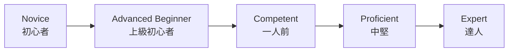
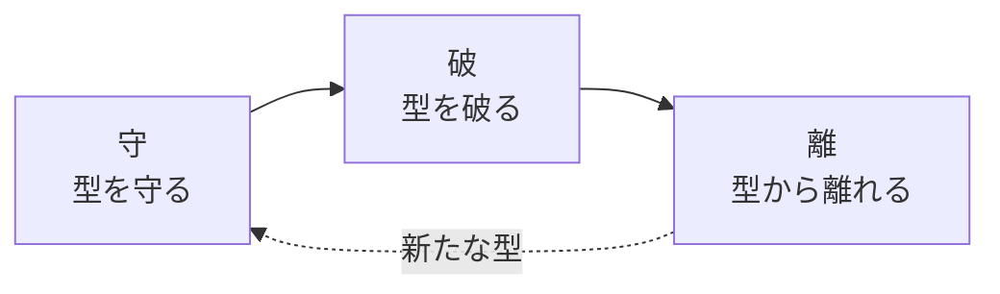
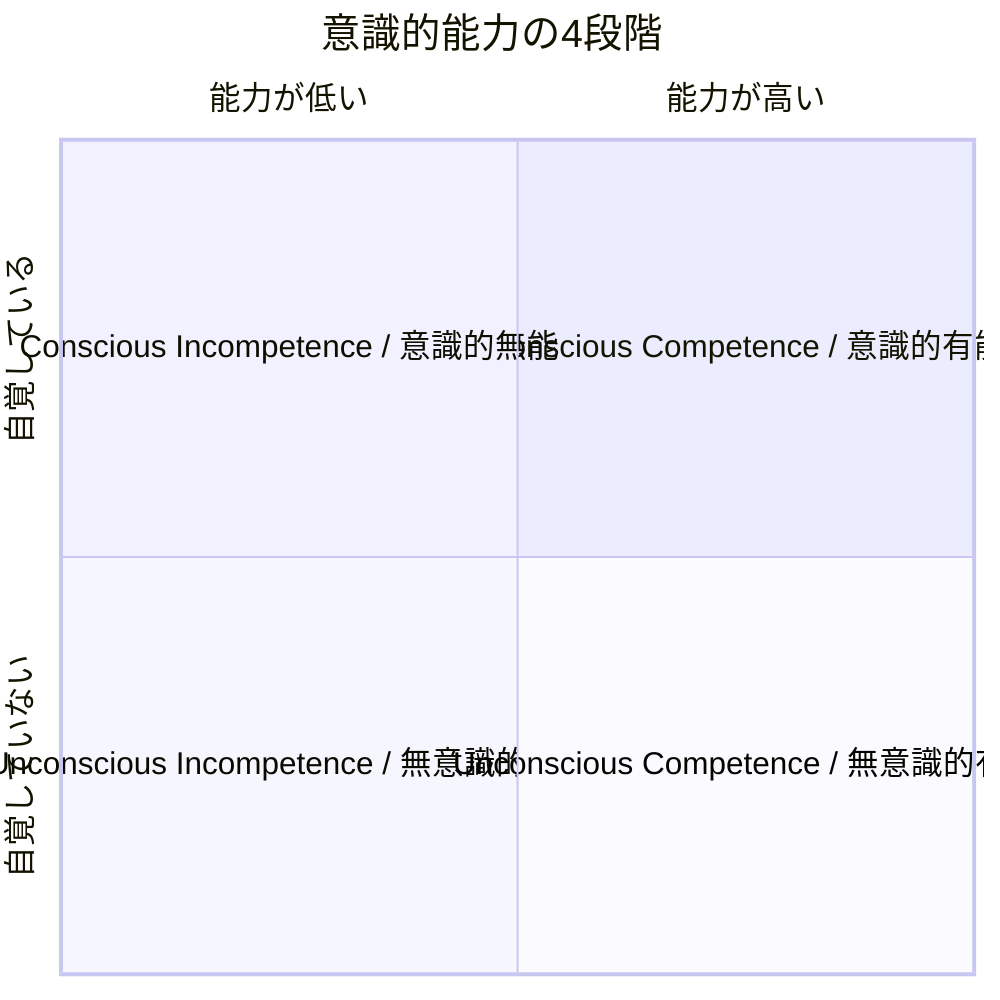
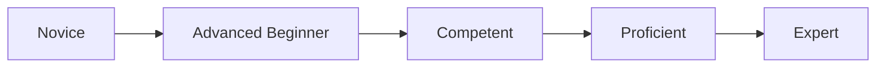
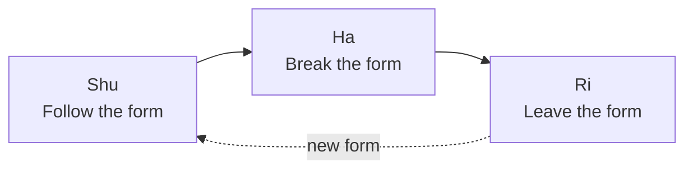
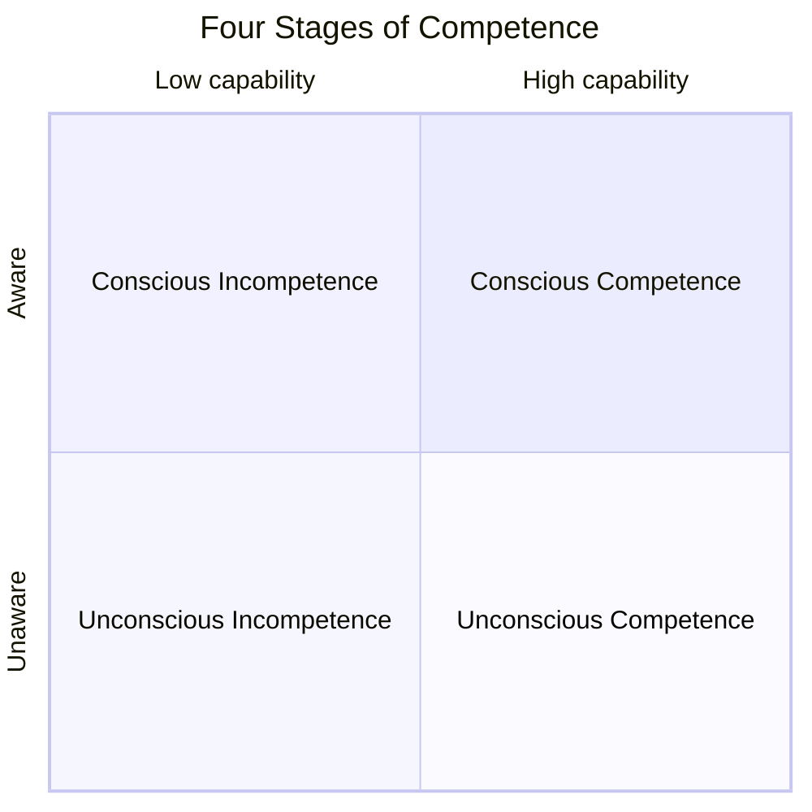

# 技術習熟の3モデル比較記事 実装計画

> **For agentic workers:** REQUIRED SUB-SKILL: Use superpowers:subagent-driven-development (recommended) or superpowers:executing-plans to implement this plan task-by-task. Steps use checkbox (`- [ ]`) syntax for tracking.

**Goal:** ドレイファスモデル・守破離・意識的能力の4段階の3フレームワークを比較解説するブログ記事（JP/EN）を `content/blog/050-skill-proficiency-stages/` に公開する。

**Architecture:** Hugo 静的サイトジェネレーターのコンテンツとして、日本語記事 `index.md` と英語記事 `index.en.md` を作成する。各フレームワーク章に Mermaid 図を1枚配置し、比較章には Markdown 表を用いる。章ごとにコミットを刻み、最後にフロントマターと出典の最終確認を行う。

**Tech Stack:** Hugo, TOMLフロントマター, Markdown, Mermaid

**参照資料:** `docs/superpowers/specs/2026-04-19-skill-proficiency-stages-design.md`

---

## ファイル構成

- 作成: `content/blog/050-skill-proficiency-stages/index.md`（日本語記事）
- 作成: `content/blog/050-skill-proficiency-stages/index.en.md`（英語記事）

既存コードベースへの影響なし。独立したコンテンツ追加のみ。

---

## Task 1: ディレクトリとフロントマター（日本語）作成

**Files:**
- Create: `content/blog/050-skill-proficiency-stages/index.md`

- [ ] **Step 1: ディレクトリを作成**

```bash
mkdir -p content/blog/050-skill-proficiency-stages
```

- [ ] **Step 2: index.md にフロントマターと概要の見出しだけ書き込む**

以下を `content/blog/050-skill-proficiency-stages/index.md` に書き込む:

```markdown
+++
title = '技術習熟の3つのモデル：ドレイファス・守破離・意識的能力の4段階'
description = 'ドレイファスモデル、守破離、意識的能力の4段階という3つの技術習熟フレームワークを比較し、それぞれの特徴と応用方法を解説します。'
date = 2026-04-19T00:00:00+09:00
draft = false
categories = ["Blog"]
tags = ["Learning", "Mastery", "Dreyfus", "Shu-Ha-Ri"]
+++

## 概要

（本文は後続タスクで記述）
```

- [ ] **Step 3: Hugo の build 確認**

Run: `hugo --quiet`
Expected: エラーなく終了

- [ ] **Step 4: コミット**

```bash
git add content/blog/050-skill-proficiency-stages/index.md
git commit -m "feat: 050記事のフロントマターとディレクトリを作成"
```

---

## Task 2: 概要 と なぜ習熟段階を理解するのか を執筆

**Files:**
- Modify: `content/blog/050-skill-proficiency-stages/index.md`

- [ ] **Step 1: 「## 概要」のプレースホルダを以下の本文で置き換え**

```markdown
## 概要

私たちが何らかの技能を身につけていく過程は、一様ではありません。初めは手順書に頼り、やがて状況に応じた判断ができるようになり、さらに進むと無意識のうちに最適な動作ができるようになります。こうした段階的な変化を捉えるために、古くから多くのモデルが提唱されてきました。

本記事では、代表的な3つの習熟フレームワーク、**ドレイファスモデル**、**守破離**、**意識的能力の4段階** を紹介し、それぞれの背景・段階構造・特徴を比較します。自分の現在地を知り、次の一歩を設計し、他者の学びを支えるための道具として、これらのモデルがどう使えるかを整理します。

## なぜ習熟段階を理解するのか

習熟を段階として捉えるメリットは、大きく3つあります。

1つ目は **自己理解** です。自分が今どの段階にいるのかが分かると、次に何を身につけるべきかが見えてきます。新人の頃に必要だった「手順を正確にこなす力」と、中堅になってから求められる「状況に応じた判断力」はまったく別のスキルです。段階を意識することで、努力の方向を誤らずに済みます。

2つ目は **学習設計** です。最終ゴールだけを見て漠然と努力するより、段階的なマイルストーンを置くほうが継続しやすく、成長も確認しやすくなります。段階ごとに「今の自分に合った学び方」が変わることも、多くのモデルが示しています。

3つ目は **他者理解** です。後輩を指導する場面や、チームメンバーの成長を見守る場面で、相手がどの段階にいるかを見立てられれば、必要な支援や関わり方を選びやすくなります。

ただし、モデルは現実そのものではありません。人の習熟は連続的で、領域ごとに段階がばらつくこともあります。本記事で紹介するモデルは、あくまで思考の補助線として使うものだと覚えておきたいところです。
```

- [ ] **Step 2: ビルド確認**

Run: `hugo --quiet`
Expected: エラーなし

- [ ] **Step 3: コミット**

```bash
git add content/blog/050-skill-proficiency-stages/index.md
git commit -m "feat: 050記事の概要と導入章を追加"
```

---

## Task 3: ドレイファスモデル章を執筆

**Files:**
- Modify: `content/blog/050-skill-proficiency-stages/index.md`

- [ ] **Step 1: 前章の末尾に以下を追記**

```markdown
## ドレイファスモデル

### 出自と背景

ドレイファスモデルは、Stuart E. Dreyfus と Hubert L. Dreyfus の兄弟が1980年にカリフォルニア大学バークレー校でまとめた報告書 "A Five-Stage Model of the Mental Activities Involved in Directed Skill Acquisition" で提唱されたモデルです。もともとは米空軍科学研究局の委託研究であり、パイロットの訓練やチェスプレイヤー、自動車運転など、幅広い技能習得を題材に論じられました。

兄のスチュワートはオペレーションズ・リサーチ、弟のヒューバートは哲学（現象学）を専門とし、2人の共著として「熟達者の判断が必ずしも明示的なルールで説明できない」という問題意識を形にしたのがこのモデルです。

後にソフトウェアエンジニアリングの領域でも、Andy Hunt の著書『Pragmatic Thinking and Learning』などを通じて広く紹介され、エンジニアの成長を語るときの共通言語のひとつになりました。

### 5段階の構造

ドレイファスモデルは、人が未経験の状態から熟達者に至るまでを5段階で描きます。



各段階の特徴は次の通りです。

**1. Novice（初心者）**
状況を文脈から切り離し、与えられたルールに従って行動します。ルールを守ることで精一杯で、例外や全体像を見る余裕はありません。料理で言えばレシピ通りに計量する段階、運転で言えばマニュアル通りにペダルとハンドルを操作する段階です。

**2. Advanced Beginner（上級初心者）**
経験を積む中で、状況に付随する特徴に気づき始めます。とはいえ、どの特徴が重要でどれが些末かの見分けはまだつかず、すべてを同じ重みで扱いがちです。先輩に細かく質問し、カバーできないケースに直面して初めて学ぶ段階と言えます。

**3. Competent（一人前）**
複数の情報の中から重要なものを選び、自分で目標と計画を立てられるようになります。ルールは内面化され、状況への適応度が上がります。一方で「正解はひとつではない」ことが分かり始め、判断の責任を感じて悩むのもこの段階の特徴です。

**4. Proficient（中堅）**
状況を全体として捉え、何が起きているかを俯瞰できるようになります。過去の類似ケースを引き寄せてパターン認識で判断し、細部をルールで詰めるのはその後、という順序に逆転していきます。直感と分析の両方を使い分けるハイブリッドな段階です。

**5. Expert（達人）**
明示的なルールを意識せず、状況に埋め込まれた「正解」を直感的に導きます。熟達した医師が患者を一目見て診断の見当をつけたり、棋士が盤面を見て候補手を絞り込むように、分析より前に判断が立ち上がります。ただし、環境が通常と大きく異なる場合には、達人も意識的な分析に戻る必要があります。

### 段階を移るときに起きる認知の変化

このモデルが示唆する重要な点は、段階を上がるにつれて認知の中心が「分析」から「パターン認識」、さらに「直感」へと移っていくことです。これは単に速くなるというだけでなく、何を見ているかが変わるという質的な変化です。

また、上位段階に進むには、ルールに従うだけでなく「ルールを文脈に応じて解釈する経験」が欠かせません。ドレイファス兄弟は、熟達とは暗黙知の獲得であり、それを教科書的に教えることは難しいと繰り返し指摘しています。
```

- [ ] **Step 2: ビルド確認**

Run: `hugo --quiet`
Expected: エラーなし

- [ ] **Step 3: コミット**

```bash
git add content/blog/050-skill-proficiency-stages/index.md
git commit -m "feat: 050記事にドレイファスモデル章を追加"
```

---

## Task 4: 守破離 章を執筆

**Files:**
- Modify: `content/blog/050-skill-proficiency-stages/index.md`

- [ ] **Step 1: 前章の末尾に以下を追記**

```markdown
## 守破離

### 出自と背景

守破離（しゅはり）は、日本の武道・茶道・華道といった伝統芸能の世界で発達してきた修行の段階論です。明確な成文として現れるのは江戸時代中期の茶人、川上不白（1719-1807）による『不白筆記』と伝えられていますが、その源流はさらに古く、世阿弥（1363-1443）が『風姿花伝』で示した「序破急」の発想や、千利休の教えに連なるとされます。

利休道歌として知られる一首に、「規矩作法 守り尽くして 破るとも 離るるとても 本（もと）を忘るな」という歌があり、これが守破離という言葉を象徴する一節としてよく引用されます。型を守り、やがて破り、さらに離れても、根本を忘れてはならない——というメッセージです。

近年では、アジャイル開発・スクラム・デザインパターン学習など、西洋生まれの知的実践にも「守破離」が応用され、日本語圏のソフトウェア業界では共通語のひとつになりました。

### 3段階の構造

守破離は、師匠と弟子の関係を前提とした3段階のモデルです。



**守**
師匠や流派の教える型を、忠実に守って稽古する段階です。自分の解釈を加えずに正確に反復することが求められます。「なぜこうするのか」は後から分かることが多く、まずは身体や思考に型を染み込ませる時期と言えます。

**破**
守の段階で体得した型を下敷きに、他流派の型や自分の工夫を取り入れて型を破っていく段階です。単なる反抗ではなく、比較と検証を通じて型を吟味する営みであり、ここで初めて「なぜそうするのか」が腹落ちしてきます。

**離**
型から離れ、独自の境地に至る段階です。このとき、型を捨てたのではなく、型が自分の一部になっているため、外から見ると型に縛られず自在に動いているように見えます。利休道歌の「本を忘るな」は、離に至っても根は守の時期にあることを戒めた言葉です。

### 西洋モデルとの違い

ドレイファスモデルが個人の認知活動の変化を描くのに対し、守破離は **共同体の中で型を受け渡す** ことを前提にしています。型には流派の歴史や先人の知恵が凝縮されており、それを正確に受け継ぐ「守」の時期がまずある、という思想です。

また、守破離は **学習者の主体性の現れ方** を段階で示すモデルとも読めます。守では受容、破では対話と検証、離では創造が中心になり、単なるスキル上達ではなく人格の成熟や世界観の拡張まで含意する点も特徴的です。

### 現代での応用例

- **ソフトウェア開発のパターン学習**: まずはデザインパターンをそのまま適用し（守）、プロジェクトに応じて変形し（破）、最終的にはパターンに頼らず問題に応じた設計ができる（離）、という学びの道筋として語られます。
- **スクラム導入**: 最初はスクラムガイドに忠実に従い、チームが習熟してきたら自分たちのコンテキストに合わせてイベントや役割を調整する、という段階論として引用されます。
- **新人教育全般**: 手順書通りに動く時期、自分なりの工夫を加える時期、仕組みそのものを設計する時期、という段階的な関わり方の指針として用いられます。
```

- [ ] **Step 2: ビルド確認**

Run: `hugo --quiet`
Expected: エラーなし

- [ ] **Step 3: コミット**

```bash
git add content/blog/050-skill-proficiency-stages/index.md
git commit -m "feat: 050記事に守破離章を追加"
```

---

## Task 5: 意識的能力の4段階 章を執筆

**Files:**
- Modify: `content/blog/050-skill-proficiency-stages/index.md`

- [ ] **Step 1: 前章の末尾に以下を追記**

```markdown
## 意識的能力の4段階

### 出自と背景

「意識的能力の4段階（Four Stages of Competence、別名 Conscious Competence Ladder）」は、1970年代に米国の Gordon Training International で講師を務めた Noel Burch が提唱したとされる学習モデルです。ただし、原型となる考え方はそれ以前から存在し、心理学者 Abraham Maslow に帰属させる説、同じく Thomas Gordon に帰属させる説もあるため、出典は完全に一意ではありません。

このモデルの特徴は、学習者の **能力の有無** と、その能力の **自覚の有無** という2つの軸を組み合わせて段階を整理している点です。能力そのものだけでなく「自分が何を知らないか／知っているか」をどれだけ意識できているかに焦点を当てており、学習者の心理面を扱いやすいフレームとして知られています。

### 4段階の構造

4つの段階は、意識と能力の組み合わせで次のように表現できます。



**1. Unconscious Incompetence（無意識的無能）**
できないことに気づいていない段階です。自分が何を知らないかすら分からないため、学習の必要性を感じません。ここからの脱出には、外部からのフィードバックや「できない現実」に気づかせる刺激が鍵になります。

**2. Conscious Incompetence（意識的無能）**
できないことを自覚した段階です。4段階のうち心理的にもっともストレスが大きく、「自分はダメだ」と感じて学習を諦めやすい危険地帯でもあります。ここを抜けるには、小さな成功体験を重ねられる環境と、安心して失敗できる関係性が重要です。

**3. Conscious Competence（意識的有能）**
意識的に注意を払えばできる段階です。手順を頭で辿りながら実行する状態で、疲れやすく遅くはあるものの、一貫して成果を出せるようになります。ここでの繰り返しが、次の段階への足場になります。

**4. Unconscious Competence（無意識的有能）**
考えなくても自然にできる段階です。タスクが自動化され、他のことに注意を振り向ける余裕が生まれます。ただし、言語化できないがゆえに「なぜそうするのか」を人に教えるのが難しくなる、という新たな課題が出てきます。

### 心理面の意義と第5段階

このモデルが他のモデルと異なるのは、**意識的無能の「谷」** をはっきりと示すところです。学ぶとは、まず「できない自分」に直面することであり、ここでの支援が学習の継続可否を大きく左右します。

近年では、第4段階の先に **Conscious Competence of Unconscious Competence（反省的有能／教えられる状態）** を置く派生モデルも提唱されています。これは、自動化された自分のスキルを再度意識に上げ、他者に言語化して伝えられる状態を指します。指導者・メンターに求められるのは、まさにこの第5段階の能力と言えるでしょう。
```

- [ ] **Step 2: ビルド確認**

Run: `hugo --quiet`
Expected: エラーなし

- [ ] **Step 3: コミット**

```bash
git add content/blog/050-skill-proficiency-stages/index.md
git commit -m "feat: 050記事に意識的能力の4段階章を追加"
```

---

## Task 6: 3フレームワークの比較章を執筆

**Files:**
- Modify: `content/blog/050-skill-proficiency-stages/index.md`

- [ ] **Step 1: 前章の末尾に以下を追記**

```markdown
## 3つのフレームワークの比較

3つのモデルは一見似ているようで、着目している側面が異なります。まずは観点ごとに整理してみます。

| 観点 | ドレイファスモデル | 守破離 | 意識的能力の4段階 |
|------|----------------|--------|-----------------|
| 段階数 | 5 | 3 | 4（派生で5） |
| 観察する側面 | 判断・行動の質 | 型との関係 | 能力と自覚の組み合わせ |
| 文化的背景 | 西洋・哲学（現象学） | 日本・伝統芸能 | 西洋・教育心理 |
| 成立時期 | 1980年 | 江戸時代（源流はより古い） | 1970年代 |
| 学習者像 | 個人の認知の変化 | 共同体で型を受け継ぐ存在 | 意識と無意識を行き来する存在 |
| 熟達の到達点 | 直感的判断 | 型から離れた自在さ | 自動化された能力 |

### 共通点

表面的な違いを超えて、3つのモデルには共通する構造もあります。

- **初期は外部依存、後期は自律** という方向性。ルールや型、意識的な努力から始まり、やがてそれらが内面化されていく。
- **最上位は言語化しにくい熟達** として描かれる。ドレイファスの Expert、守破離の離、4段階の Unconscious Competence はいずれも、明示的な指示を超えた領域を指します。
- **段階の移行は直線ではない**。どのモデルも、ある段階に必要な学びが次の段階に進むと不要になるのではなく、基礎として残り続けることを前提にしています。

### 相違点

一方で、着目点の違いは明確です。

- **ドレイファスモデル** は「判断の質」にフォーカスします。ルール適用から直感的パターン認識への変化を、認知科学的に描いています。
- **守破離** は「型との関係」にフォーカスします。型を共有する共同体の存在と、そこから個として独立していく筋道を描きます。
- **意識的能力の4段階** は「意識の状態」にフォーカスします。特に「自分ができないと気づく瞬間」という心理的な転換点を明示的に扱います。

### どのモデルをいつ使うか

- **自分や他者の行動パターンを分析したい** とき → ドレイファスモデル
- **師匠・メンター・型が存在する学習環境** で段階を捉えたいとき → 守破離
- **学習者の心理状態を支えたい、挫折しそうな人を支援したい** とき → 意識的能力の4段階

目的に応じて使い分けるのが実践的で、1つに絞る必要はありません。むしろ、ある学習者の状況を複数のモデルで見てみると、違う側面が見えてくることが多いでしょう。
```

- [ ] **Step 2: ビルド確認**

Run: `hugo --quiet`
Expected: エラーなし

- [ ] **Step 3: コミット**

```bash
git add content/blog/050-skill-proficiency-stages/index.md
git commit -m "feat: 050記事に比較章を追加"
```

---

## Task 7: 応用章 と まとめ を執筆

**Files:**
- Modify: `content/blog/050-skill-proficiency-stages/index.md`

- [ ] **Step 1: 前章の末尾に以下を追記**

```markdown
## 応用：学習とプロダクト設計への活かし方

これらのフレームワークは、単なる知識として知っておくだけでなく、実際の学習や設計の現場で使える道具でもあります。代表的な3つの使い道を挙げておきます。

### 1. 自分の学習計画に使う

身につけたい領域について、「今の自分はどの段階にいるか」を複数のモデルから見立ててみます。ドレイファスで見ると一人前だが、意識的能力で見ると実はまだ意識的有能に留まっている——といったズレを発見すると、次に必要な学習行動が具体化します。たとえば「型を破る経験」が足りないと気づけば、他流派（他チーム・他ツール・他言語）の考え方に触れに行く計画が立てられます。

### 2. 他者の指導・メンタリングに使う

相手の段階によって、効果的な関わり方は変わります。

- 初心者・無意識的無能には、正確なルールや型を示し、まず安全に反復できる環境を用意する
- 意識的無能の学習者には、小さな成功体験の積み重ねと、失敗を肯定する関係性を
- 一人前・破の段階には、判断の責任を渡し、意思決定のレビューで支える
- 中堅・達人・離の段階には、自身の経験を言語化して後進に伝える機会を

相手の段階を見誤ると、助けが押しつけになったり、放任が放置になったりします。段階を意識することで、関わり方を選ぶ精度が上がります。

### 3. プロダクト・アプリ設計に使う

ユーザーの習熟段階に応じた設計も、これらのモデルから多くを学べます。

- **オンボーディング**: 初心者には明示的なガイド・手順・制約を設ける。守の段階に相当します。
- **モード切替**: 習熟したユーザーには、ショートカットや上級モードを用意し、ルール表示を減らす。破や離の段階に寄り添う設計です。
- **意識的無能の支援**: 「何が分からないか分からない」状態のユーザーには、何を学ぶべきかを明示する診断・チュートリアルが効きます。
- **段階の移行を促すフィードバック**: 単にエラーを返すのではなく、今の段階の次に進むヒントを示す設計は、学習者としてのユーザーに寄り添う姿勢の表れです。

こうした視点でプロダクトを眺め直すと、機能の優先順位や情報設計が整理しやすくなります。

## まとめ

技術習熟を段階として捉えるフレームワークは数多くありますが、ドレイファスモデル・守破離・意識的能力の4段階の3つは、それぞれ着目点が異なり、互いを補い合う関係にあります。

- ドレイファスモデルは **判断の質の変化** を
- 守破離は **型との関係の変化** を
- 意識的能力の4段階は **意識と能力の組み合わせ** を

描くモデルです。

モデルはあくまで地図であり、領土そのものではありません。現実の学習者は連続的に変化し、領域によって段階がばらつきもします。それでも、地図があれば自分の現在地を見立て、次の一歩を選ぶ助けになります。自分自身の学習、他者への関わり、そしてプロダクト設計のそれぞれで、これらのモデルを状況に応じて使い分けてみると、見えてくるものが変わるはずです。

### 参考文献

- Stuart E. Dreyfus, Hubert L. Dreyfus, "A Five-Stage Model of the Mental Activities Involved in Directed Skill Acquisition"（1980年, U.S. Air Force Office of Scientific Research）
- Andy Hunt『Pragmatic Thinking and Learning: Refactor Your Wetware』（2008年, Pragmatic Bookshelf）
- 川上不白『不白筆記』
- 世阿弥『風姿花伝』
- Noel Burch, "The Four Stages for Learning Any New Skill"（1970年代, Gordon Training International）
```

- [ ] **Step 2: ビルド確認**

Run: `hugo --quiet`
Expected: エラーなし

- [ ] **Step 3: 文字数を確認**

Run: `wc -m content/blog/050-skill-proficiency-stages/index.md`
Expected: 8000字以上

- [ ] **Step 4: コミット**

```bash
git add content/blog/050-skill-proficiency-stages/index.md
git commit -m "feat: 050記事に応用章とまとめを追加"
```

---

## Task 8: 英語版を作成（フロントマター + 概要 + 導入章）

**Files:**
- Create: `content/blog/050-skill-proficiency-stages/index.en.md`

- [ ] **Step 1: 以下のフロントマターと冒頭2章を index.en.md に書き込む**

```markdown
+++
title = 'Three Models of Technical Proficiency: Dreyfus, Shu-Ha-Ri, and the Four Stages of Competence'
description = 'Compare three frameworks for technical proficiency—the Dreyfus model, Shu-Ha-Ri, and the Four Stages of Competence—and explore their characteristics and applications.'
date = 2026-04-19T00:00:00+09:00
draft = false
categories = ["Blog"]
tags = ["Learning", "Mastery", "Dreyfus", "Shu-Ha-Ri"]
+++

## Overview

The process of acquiring a skill is rarely uniform. We start by relying on manuals, then learn to judge based on context, and eventually reach a stage where the right action comes without conscious thought. To capture these gradual changes, many models have been proposed over the decades.

This article introduces three representative frameworks for technical proficiency—the **Dreyfus model**, **Shu-Ha-Ri**, and the **Four Stages of Competence**—and compares their origins, stages, and characteristics. The goal is to offer a toolkit for understanding where we are, designing our next step, and supporting the learning of others.

## Why Understand the Stages of Proficiency

Thinking of proficiency as a set of stages provides three main benefits.

First, **self-awareness**. Knowing which stage you are in clarifies what to work on next. The skills that matter for a beginner (executing procedures correctly) differ greatly from those that matter for a mid-level practitioner (judgment in context). Awareness of stages prevents misdirected effort.

Second, **learning design**. Rather than chasing a vague final goal, stage-based milestones make progress easier to sustain and measure. Many models also suggest that the optimal way to learn changes from stage to stage.

Third, **understanding others**. In mentoring or team leadership, estimating someone's current stage helps you choose the right support and level of challenge.

That said, models are not reality. Real learning is continuous and often uneven across domains. The frameworks below are best used as guideposts for thinking, not as rigid categorizations.
```

- [ ] **Step 2: ビルド確認**

Run: `hugo --quiet`
Expected: エラーなし

- [ ] **Step 3: コミット**

```bash
git add content/blog/050-skill-proficiency-stages/index.en.md
git commit -m "feat: 050記事の英語版に導入章を追加"
```

---

## Task 9: 英語版に ドレイファスモデル 章を追記

**Files:**
- Modify: `content/blog/050-skill-proficiency-stages/index.en.md`

- [ ] **Step 1: 前章の末尾に以下を追記**

```markdown
## The Dreyfus Model

### Origin and Background

The Dreyfus model was proposed in 1980 by brothers Stuart E. Dreyfus and Hubert L. Dreyfus at UC Berkeley, in a report titled "A Five-Stage Model of the Mental Activities Involved in Directed Skill Acquisition." Commissioned by the U.S. Air Force Office of Scientific Research, the report drew on pilot training, chess players, drivers, and other skilled practitioners.

Stuart specialized in operations research while Hubert specialized in philosophy (phenomenology). Together they formalized a key insight: the judgments of experts often cannot be reduced to explicit rules.

The model later became popular in software engineering thanks to books such as Andy Hunt's *Pragmatic Thinking and Learning*, and has become a shared vocabulary for discussing engineer growth.

### Five Stages

The Dreyfus model describes the journey from novice to expert in five stages.



**1. Novice**
Detaches from context and follows given rules. Following the rules is itself challenging, leaving little room to see exceptions or the bigger picture. Think of measuring ingredients from a recipe, or operating the pedals and wheel by the manual when learning to drive.

**2. Advanced Beginner**
Begins to notice contextual features through experience, but cannot yet distinguish important features from minor ones, and treats them with equal weight. This is the stage where learners ask many questions and encounter situations their rules don't cover.

**3. Competent**
Selects important information from a pool of signals and can set goals and plans on their own. Rules have become internalized. At the same time, learners begin to sense that "there is no single right answer," and may feel the weight of decision-making.

**4. Proficient**
Grasps situations holistically. Pattern recognition from past similar cases comes first; detailed rule-based reasoning fills in afterward. This is a hybrid stage where intuition and analysis work together.

**5. Expert**
Arrives at answers intuitively, embedded in the situation itself, without explicit rule-following. A seasoned doctor estimates a diagnosis at a glance; a master player narrows candidate moves before deliberate analysis. However, when the environment is unusual, even experts fall back on deliberate analysis.

### Cognitive Shifts Between Stages

The key insight of this model is that as stages progress, the center of cognition shifts from **analysis** to **pattern recognition** to **intuition**. This is not merely a speed-up but a qualitative change in what the practitioner perceives.

Moving up requires more than rule-following—it requires experience in interpreting rules in context. The Dreyfus brothers repeatedly note that mastery is tacit knowledge that textbooks alone cannot teach.
```

- [ ] **Step 2: ビルド確認**

Run: `hugo --quiet`
Expected: エラーなし

- [ ] **Step 3: コミット**

```bash
git add content/blog/050-skill-proficiency-stages/index.en.md
git commit -m "feat: 050記事の英語版にDreyfusモデル章を追加"
```

---

## Task 10: 英語版に 守破離 章を追記

**Files:**
- Modify: `content/blog/050-skill-proficiency-stages/index.en.md`

- [ ] **Step 1: 前章の末尾に以下を追記**

```markdown
## Shu-Ha-Ri

### Origin and Background

Shu-Ha-Ri (守破離) is a Japanese model of training stages that emerged from traditional arts such as martial arts, tea ceremony, and flower arrangement. It appears explicitly in *Fuhaku Hikki*, a text by the Edo-period tea master Kawakami Fuhaku (1719-1807). Its roots trace back further, to Zeami's (1363-1443) *Fūshikaden* and its idea of *Jo-Ha-Kyū*, and to the teachings of Sen no Rikyū.

A poem often attributed to Rikyū reads, "Keep the forms of rules and manners until you break them, and even when you leave them, do not forget the origin." This line neatly captures the spirit of Shu-Ha-Ri: preserve the form, then break it, then transcend it—without losing its root.

In recent years, Shu-Ha-Ri has been applied to Western practices such as agile development, Scrum adoption, and design pattern learning, becoming a shared vocabulary among Japanese-speaking software professionals.

### Three Stages

Shu-Ha-Ri is a three-stage model built on a master-apprentice relationship.



**Shu (守)**
Practice the forms taught by the master faithfully, without adding personal interpretation. The goal is to imprint the form onto body and mind. The "why" often comes later; what matters first is precise repetition.

**Ha (破)**
Building on the forms absorbed in Shu, the learner incorporates forms from other schools and personal adaptations, breaking the form. This is not mere rebellion but thoughtful comparison and testing. Here, the learner finally feels the reason behind the form.

**Ri (離)**
Leave the form and reach an independent mode of being. This is not discarding the form—by now, the form has become part of the self. Externally, the practitioner appears free and unconstrained. The phrase "do not forget the origin" warns that even at Ri, the root remains in Shu.

### Differences from Western Models

Where the Dreyfus model describes changes in an individual's cognition, Shu-Ha-Ri presumes that **forms are passed within a community**. The form encodes the history of the school and the wisdom of predecessors; inheriting it accurately is the purpose of Shu.

Shu-Ha-Ri also describes how the learner's **agency** changes. Reception dominates in Shu, dialogue and testing in Ha, creation in Ri. The model implies a maturation of the whole person, not only a skill upgrade.

### Modern Applications

- **Learning design patterns**: Apply patterns literally (Shu), adapt them to project context (Ha), and eventually design from first principles without needing patterns (Ri).
- **Scrum adoption**: Start by following the Scrum Guide strictly, then adapt events and roles once the team has matured.
- **Onboarding in general**: As a guide for how a mentor's stance should shift from prescribing procedures to reviewing decisions to co-creating systems.
```

- [ ] **Step 2: ビルド確認**

Run: `hugo --quiet`
Expected: エラーなし

- [ ] **Step 3: コミット**

```bash
git add content/blog/050-skill-proficiency-stages/index.en.md
git commit -m "feat: 050記事の英語版に守破離章を追加"
```

---

## Task 11: 英語版に 意識的能力の4段階 章を追記

**Files:**
- Modify: `content/blog/050-skill-proficiency-stages/index.en.md`

- [ ] **Step 1: 前章の末尾に以下を追記**

```markdown
## The Four Stages of Competence

### Origin and Background

The "Four Stages of Competence" (also known as the Conscious Competence Ladder) is commonly attributed to Noel Burch of Gordon Training International in the 1970s. However, similar ideas are sometimes attributed to Abraham Maslow or Thomas Gordon, so the origin is not entirely settled.

The distinctive feature of this model is that it combines two axes: whether a learner **has a capability**, and whether they are **aware of having or lacking it**. By focusing on awareness as much as ability, the model is particularly good at describing the learner's psychological state.

### Four Stages

The four stages can be organized as a 2x2 matrix.



**1. Unconscious Incompetence**
The learner is not aware of what they cannot do, and thus sees no need to learn. Escape from this stage usually requires external feedback or a vivid encounter with one's own limits.

**2. Conscious Incompetence**
The learner recognizes their inability. This is psychologically the hardest stage, where self-doubt can derail learning. It helps to have an environment that offers small wins and a relationship that makes failure safe.

**3. Conscious Competence**
The learner can perform, but only with deliberate effort and attention. Execution is slow and tiring, yet consistently produces results. Repetition here builds the foundation for the next stage.

**4. Unconscious Competence**
The learner performs naturally, without conscious thought. Attention is freed for other things. A new challenge emerges: because the skill is tacit, it becomes hard to explain "why" to others.

### Psychological Significance and a Fifth Stage

Unlike other models, this one explicitly names the **valley of Conscious Incompetence**. Learning starts with confronting one's incompetence; how well we support learners at this stage largely determines whether they continue.

Some variants add a fifth stage: **Conscious Competence of Unconscious Competence**, sometimes called "reflective competence." This is the state of being able to re-examine one's tacit skill and articulate it for others—a state mentors and teachers aspire to.
```

- [ ] **Step 2: ビルド確認**

Run: `hugo --quiet`
Expected: エラーなし

- [ ] **Step 3: コミット**

```bash
git add content/blog/050-skill-proficiency-stages/index.en.md
git commit -m "feat: 050記事の英語版に意識的能力の4段階章を追加"
```

---

## Task 12: 英語版に 比較章 を追記

**Files:**
- Modify: `content/blog/050-skill-proficiency-stages/index.en.md`

- [ ] **Step 1: 前章の末尾に以下を追記**

```markdown
## Comparing the Three Frameworks

At first glance the three models look similar, but they focus on different aspects.

| Dimension | Dreyfus Model | Shu-Ha-Ri | Four Stages of Competence |
|-----------|---------------|-----------|---------------------------|
| Number of stages | 5 | 3 | 4 (5 in variants) |
| Focus | Quality of judgment and action | Relationship to form | Combination of ability and awareness |
| Cultural background | Western / phenomenology | Japanese / traditional arts | Western / education psychology |
| Period of formulation | 1980 | Edo period (with older roots) | 1970s |
| Implied learner | An individual cognition changing | A member inheriting form within a community | A self moving between conscious and unconscious |
| Top-stage ideal | Intuitive judgment | Free action beyond form | Automatic, effortless execution |

### Commonalities

Beneath the surface, the models share structural features.

- A direction from **external dependence to autonomy**. Rules, forms, or conscious effort are the starting point; they become internalized over time.
- The top stage is described as **mastery that resists easy verbalization**. Dreyfus's Expert, Shu-Ha-Ri's Ri, and the Four Stages' Unconscious Competence all point to territory beyond explicit instruction.
- Progression is **not linear**. Earlier skills remain as foundations rather than being discarded.

### Differences

The points of focus clearly diverge.

- The **Dreyfus model** focuses on the quality of judgment, tracing the cognitive shift from rule-application to intuitive pattern recognition.
- **Shu-Ha-Ri** focuses on relationship with form and the community that transmits it.
- The **Four Stages of Competence** focuses on states of awareness, especially the pivot of realizing one's own incompetence.

### Which to Use When

- To analyze patterns of behavior and judgment → the **Dreyfus model**
- To describe a learning environment with a master, mentor, or shared form → **Shu-Ha-Ri**
- To support learners psychologically, especially near the valley of doubt → the **Four Stages of Competence**

They complement each other, and it is often useful to view a single learner through multiple lenses.
```

- [ ] **Step 2: ビルド確認**

Run: `hugo --quiet`
Expected: エラーなし

- [ ] **Step 3: コミット**

```bash
git add content/blog/050-skill-proficiency-stages/index.en.md
git commit -m "feat: 050記事の英語版に比較章を追加"
```

---

## Task 13: 英語版に 応用 と まとめ を追記

**Files:**
- Modify: `content/blog/050-skill-proficiency-stages/index.en.md`

- [ ] **Step 1: 前章の末尾に以下を追記**

```markdown
## Applications: Learning and Product Design

These frameworks are useful not only as knowledge but as tools. Three common applications:

### 1. Designing Your Own Learning

Assess your current stage through multiple models. If you look solid as a Competent on Dreyfus but are still at Conscious Competence on the awareness axis, you have discovered a concrete next step. Noticing that you lack "experience breaking the form" can motivate you to seek exposure to other schools (other teams, tools, or languages).

### 2. Mentoring and Supporting Others

Different stages call for different involvement.

- For novices and the unconsciously incompetent: provide explicit rules and a safe environment for repetition.
- For the consciously incompetent: stack small wins and affirm that failure is part of the process.
- For Competent learners / those at Ha: hand over decision-making responsibility and support through decision reviews.
- For Proficient, Expert, or Ri learners: create opportunities to articulate their tacit knowledge for others.

Misjudging the stage turns help into imposition or detachment. Being stage-aware improves the precision of involvement.

### 3. Product and App Design

These models also inform how we design for users with varying levels of expertise.

- **Onboarding**: Provide explicit guides, step-by-step flows, and constraints for beginners (the Shu stage).
- **Mode switching**: Offer shortcuts and advanced modes for experienced users, and reduce boilerplate hints (Ha and Ri).
- **Supporting Conscious Incompetence**: Users who "don't know what they don't know" benefit from diagnostics and tutorials that point to what needs learning.
- **Feedback that promotes stage transitions**: Rather than just returning errors, show hints for the learner's next step.

Viewing a product through these lenses tends to clarify feature priorities and information architecture.

## Summary

Among the many frameworks describing technical proficiency, the Dreyfus model, Shu-Ha-Ri, and the Four Stages of Competence offer complementary lenses.

- The Dreyfus model captures **changes in the quality of judgment**.
- Shu-Ha-Ri captures **changes in the relationship with form**.
- The Four Stages of Competence captures **the interplay of awareness and ability**.

Models are maps, not the territory. Real learners change continuously, and their stages can vary across domains. Still, a map helps us estimate where we are and choose the next step. Use these frameworks as situation-appropriate tools—for your own learning, your relationships with others, and the products you build.

### References

- Stuart E. Dreyfus, Hubert L. Dreyfus, "A Five-Stage Model of the Mental Activities Involved in Directed Skill Acquisition" (1980, U.S. Air Force Office of Scientific Research)
- Andy Hunt, *Pragmatic Thinking and Learning: Refactor Your Wetware* (2008, Pragmatic Bookshelf)
- Kawakami Fuhaku, *Fuhaku Hikki*
- Zeami, *Fūshikaden*
- Noel Burch, "The Four Stages for Learning Any New Skill" (1970s, Gordon Training International)
```

- [ ] **Step 2: ビルド確認**

Run: `hugo --quiet`
Expected: エラーなし

- [ ] **Step 3: コミット**

```bash
git add content/blog/050-skill-proficiency-stages/index.en.md
git commit -m "feat: 050記事の英語版に応用章とまとめを追加"
```

---

## Task 14: 最終検証とPR作成

**Files:**
- 作業対象ファイルはなし（検証のみ）

- [ ] **Step 1: 全体ビルドして警告がないか確認**

Run: `hugo --quiet`
Expected: 警告・エラーなし

- [ ] **Step 2: 日本語記事の文字数が8000字以上か確認**

Run: `wc -m content/blog/050-skill-proficiency-stages/index.md`
Expected: 8000以上

- [ ] **Step 3: Hugo server を起動して目視確認**

Run: `hugo server`
Expected: `http://localhost:1313/blog/050-skill-proficiency-stages/` と `http://localhost:1313/en/blog/050-skill-proficiency-stages/` の両方が正常表示される。Mermaid図が描画される。

- [ ] **Step 4: リモートにブランチをプッシュ**

Run:
```bash
git push -u origin feat/050-skill-proficiency-stages
```

- [ ] **Step 5: PR を作成**

Run:
```bash
gh pr create --title "feat: 技術習熟の3モデル比較記事(050)を追加" --body "$(cat <<'EOF'
## Summary
- ドレイファスモデル・守破離・意識的能力の4段階の3フレームワークを比較する記事を `content/blog/050-skill-proficiency-stages/` に追加
- 日本語記事（`index.md`）と英語記事（`index.en.md`）をセットで作成
- 各フレームワーク章に Mermaid 図を配置、比較章には比較表を配置
- categories は `Blog`、tags は `Learning`, `Mastery`, `Dreyfus`, `Shu-Ha-Ri`

## Test plan
- [ ] `hugo --quiet` で警告・エラーなし
- [ ] 日本語記事が 8000字以上
- [ ] `hugo server` でJP/EN双方のページが正しく表示される
- [ ] Mermaid図がすべて描画される
- [ ] Google Search Console で description が正しく取得されることを後日確認
EOF
)"
```

---

## Self-Review

### Spec coverage
- 設計書の章立て（概要、導入、ドレイファス、守破離、意識的能力、比較、応用、まとめ）をすべて Task 2〜7 でカバー。
- 英語版も Task 8〜13 で同じ章構造をカバー。
- 参考文献（設計書の検証項目）は Task 7 と Task 13 のまとめ章に含めた。
- Mermaid 図は Task 3（Dreyfus）、Task 4（守破離）、Task 5（意識的能力）に配置済み。

### Placeholder scan
- Task 1 のみ「本文は後続タスクで記述」という一時的プレースホルダを置いているが、これは Task 2 で即座に置換される。
- それ以外の Task では、本文コードブロックを完全な形で記載済み。

### Type consistency
- 固有名詞表記を横断チェック:
  - `Shu-Ha-Ri`（ハイフン統一）
  - `Four Stages of Competence`（大文字統一）
  - `Dreyfus model`（大文字統一）
  - 日本語の「守破離」「意識的能力の4段階」「ドレイファスモデル」も一貫。
- Mermaid のラベルも日本語版／英語版それぞれの言語で揃っている。

### Scope check
- 単一記事の追加のみ。既存ファイルへの影響なし。1つの計画として適切。

---

## Next Step

実装計画に沿って、各 Task を実行する。
